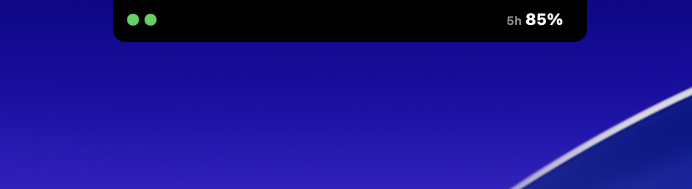
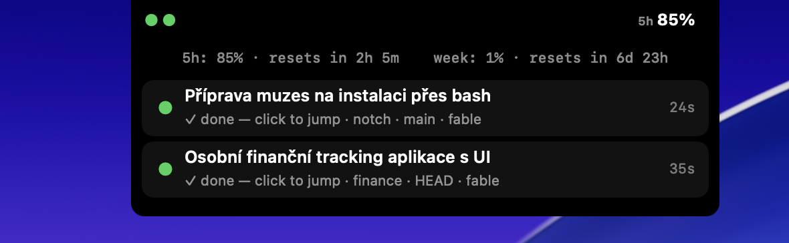

# NotchOverlay

**Dynamic Island for your Mac — watch your AI coding agents right in the notch.**

NotchOverlay turns the MacBook display cutout into a live dashboard of your
running Claude Code sessions: colored dots tell you who's working, who's done
and who's waiting for you, with your real rate-limit percentages ticking
alongside. Hover to expand the island into a panel with per-session details —
jump straight into the right terminal, or approve/deny a permission request
with one click, without switching windows. Native AppKit, zero dependencies,
tokens never leave your machine.

[](https://buymeacoffee.com/matejkrcek)

*Czech version: [README.cs.md](README.cs.md)*

## What it looks like

Compact state in the notch — session dots on the left, limit usage on the right:



Hover → expanded panel with all sessions, quotas and Allow/Deny buttons:



## Install

### Homebrew (recommended)

```sh
brew tap matejkrcek/notchoverlay
brew trust matejkrcek/notchoverlay   # newer Homebrew requires trusting third-party taps
brew install --cask notchoverlay
```

The quarantine flag is removed automatically (postflight) — nothing to approve
manually.

### DMG

Download `NotchOverlay.dmg` from [Releases](https://github.com/MatejKrcek/NotchOverlay/releases)
and drag the app into Applications. The app is ad-hoc signed, so Gatekeeper
blocks it after download ("cannot verify the developer"). To allow it:

- right-click the app → **Open** → confirm **Open** (older macOS:
  System Settings → Privacy & Security → **Open Anyway**), or
- in the terminal: `xattr -cr /Applications/NotchOverlay.app`

### From source (Xcode Command Line Tools are enough)

```sh
curl -fsSL https://raw.githubusercontent.com/MatejKrcek/NotchOverlay/main/install.sh | bash
```

Or from a cloned repo:

```sh
./install.sh   # build → /Applications/NotchOverlay.app + LaunchAgent
               # (starts at login, auto-restarts on crash)
```

> Difference: installing from source also adds a LaunchAgent (the app starts
> at login and restarts after a crash). Homebrew/DMG just installs the app —
> you launch it yourself from /Applications.

## First launch

1. Open **NotchOverlay** from /Applications — a settings window appears and
   the island shows up in the notch. Reopen the window anytime by clicking
   the app or **right-clicking the island**.
2. **Sign in with Claude** (in the window) — quotas are otherwise read from
   Claude Code credentials, so if you use Claude Code you usually don't need to.
3. The first time you use the **Allow/Deny** buttons, macOS asks for the
   **Automation** permission (System Events + your terminal) — grant it,
   otherwise the buttons have no way to send the answer to the terminal.
4. Optional: `hooks/install-hooks.sh` for more precise events (see below).

## Update

- Homebrew: `brew update && brew upgrade --cask notchoverlay`
- DMG: download a new one from Releases and replace the app
- From source: run the install one-liner again

## Uninstall

```sh
# Homebrew:
brew uninstall --cask notchoverlay

# DMG / from source:
launchctl bootout gui/$UID/com.matejkrcek.notchoverlay 2>/dev/null
rm -rf /Applications/NotchOverlay.app ~/Library/LaunchAgents/com.matejkrcek.notchoverlay.plist
```

Quit without uninstalling: app window → **Quit NotchOverlay** (stays off
until your next login).

## Development without installing

```sh
./build.sh          # compile (swiftc; SPM is broken on this machine)
./bin/NotchOverlay  # run it for a spin
```

## Features

- **Compact state in the notch** — agent status dots on the left, "5h X %"
  on the right (real 5-hour window usage from the API), or ⚠ N when
  something waits for you. A floating pill on displays without a notch.
- **Hover → expand** — the panel unfolds below the notch: a header with
  quotas (5h window + weekly limit in %, reset times) and a row per session
  (ai-title name, state, project, branch, model, time since last activity).
- **Real quotas** — OAuth token from Keychain (own login, otherwise
  "Claude Code-credentials") → `api.anthropic.com/api/oauth/usage`,
  refreshed every 5 min. The token never leaves your machine except to the
  Anthropic API. Debug: `~/.claude/vibe-quota-debug.txt`.
- **Colors**: blue = working · green = done · orange = needs your action
  (permission/question/stalled) · red = failed (API error).
- **Click a row → jump to the terminal** (TERM_PROGRAM from hooks, otherwise
  the first running known terminal: iTerm2, Ghostty, Warp, WezTerm, kitty,
  Alacritty, Terminal, VS Code/Cursor).
- **Allow/Deny buttons** on permission requests — they activate the terminal
  and send a keystroke into the dialog (1 = allow, Esc = deny; requires the
  Automation permission for System Events).
- **8-bit sounds** — synthesized square wave (start, permission, question,
  done, deny). Off by default; enable in settings.
- **Non-activating overlay** — the panel never steals focus or activation.
- **Settings** (click the app or right-click the island) — island on/off,
  size (0.7–1.5×), sounds, tokens per session, quota in the bar, header
  second line (Codex limit from local session data / Fable 5 limit),
  Claude/Codex/Gemini accounts with sign in/out, and Quit.

## Data sources

1. **Passive**: tailing transcripts `~/.claude/projects/**/*.jsonl` every
   1.5 s (state from the transcript tail + mtime). Works with zero
   configuration.
2. **Hooks** (more precise events): `hooks/install-hooks.sh` registers
   `hooks/vibe-event.sh` in `~/.claude/settings.json` for SessionStart,
   Notification, Stop and SessionEnd. Events flow through a file queue in
   `~/.claude/vibe-events/`. **Uninstall**: restore
   `~/.claude/settings.json.vibe-backup` or remove the `vibe-event.sh` entries.

Debug: the app continuously writes the current session state to
`~/.claude/vibe-state.json`.

## Contributing

Contributions are welcome! The repo is public, but only the maintainer can
push — the standard GitHub flow applies:

1. Fork the repo and create a branch.
2. Make your change (`./build.sh` must pass).
3. Open a pull request — I review and merge.

## Support

The app is free and open source. If it saves you time, you can buy me a
coffee: **[buymeacoffee.com/matejkrcek](https://buymeacoffee.com/matejkrcek)** ☕

---

Developed by **[Matej Krcek](https://www.linkedin.com/in/matejkrcek)** from
**[Kreedl](https://kreedl.com)**.
